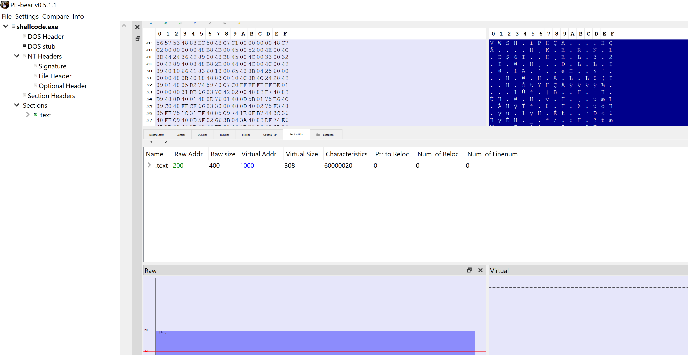

# solstice

A multi-stage PE loader for [@carrot_c4k3](https://twitter.com/carrot_c4k3)'s CollateralDamage Xbox One exploit.

## How to build it

**This project has only been built and tested using `x86_64-pc-windows-msvc` on Windows 11. It will likely build on any 64-bit Windows, but has not been tested across different versions.**

1. Clone this repo and its dependencies:

```shell
git clone https://github.com/exploits-forsale/solstice.git
cd solstice
```
2. Ensure rust nightly is installed: `rust toolchain install nightly`
3. Install `just`: https://github.com/casey/just
4. Run:

```
just build-exploit
```

All necessary outputs will be in the `outputs/` directory.

If you would like to test on the PC version of GameScript, running the following command will build execute `build-exploit`, but will copy the artifacts to the GameScript directory and overwrite its autosave state so all you have to do is click "run code":

```
just generate
```

Currently the stage2 shellcode attempts to open and run `run.exe` out of GameScript's `LocalState` directory.

### Alternate build modes

#### Building for network development

**ENSURE THAT A `host_ip.txt` EXISTS IN THE ROOT OF THE REPO THAT POINTS TO THE IP ADDRESS THAT WILL BE HOSTING THE `STAGE2`/`run.exe` DELIVERY SERVER**

1. Build necessary stages with:

```
just generate-dev
```

2. Copy `outputs/gamescript_autosave_network.txt` to GameScript
3. Run the server:

```
# Defaults to using the test_rust_program.exe as run.exe
just run-server

# Optionally use the following command to specify a run.exe
just run-server ./path/to/file.exe
```

#### Building with debug output (only works with WinDbg)

If testing on PC, you can build in debug mode to get debug output in WinDbg.

1. Build

```
just generate
```

2. Run GameScript
3. Attach WinDbg
4. Run the exploit

## Project overview


```
        ┌──────────────────────────┐                                                 
        │ GameScript With Exploit  │                                                 
        │     ┌──────────────┐     │                                                 
 ┌────┐ │     │              │     │                                                 
 │ 1  │ │     │  stage1.bin  │◀─ReadFile/VirtualAlloc─┐                              
 └────┘ │     │              │     │                  │                              
        │     └──────────────┘     │                  │                              
        └──────────────────────────┘                  │                              
                                                      │                              
                                            ┌─────────▼─────────────────────┐        
                                            │ ┌──────────────┐ ┌──────────┐ │        
                                            │ │              │ │          │ │        
                                            │ │  stage2.bin  │ │  run.exe │ │        
                                            │ │              │ │          │ │        
                                            │ └──────────────┘ └──────────┘ │        
                                            │  File System           ▲      │        
                                            └────────────────────────┼──────┘        
                                                                     │               
                                                                Reflective           
      ┌─────────────────────────────────────────────────────┐   PE Loader            
      │ GameScript With Exploit                             │        │               
      │ ┌──────────────┐                ┌──────────────┐    │        │               
┌────┐│ │              │                │              │    │        │               
│ 2  ││ │  stage1.bin  │────invoke()───▶│  stage2.bin  │◀───┼────────┘               
└────┘│ │              │                │              │    │                        
      │ └──────────────┘                └──────────────┘    │                        
      └─────────────────────────────────────────────────────┘                        
                                                                                     
                                                                                     
      ┌─────────────────────────────────────────────────────────────────────────────┐
      │ GameScript With Exploit                                                     │
┌────┐│ ┌──────────────┐                ┌──────────────┐               ┌──────────┐ │
│ 3  ││ │              │                │              │               │          │ │
└────┘│ │  stage1.bin  │────invoke()───▶│  stage2.bin  │───invoke()───▶│  run.exe │ │
      │ │              │                │              │               │          │ │
      │ └──────────────┘                └──────────────┘               └──────────┘ │
      └─────────────────────────────────────────────────────────────────────────────┘        ┌──────────────────────────┐                                                              
        │ GameScript With Exploit  │                                                              
        │     ┌──────────────┐     │                                                              
 ┌────┐ │     │              │     │                                                              
 │ 1  │ │     │  stage1.bin  │◀─ReadFile/VirtualAlloc─┐                                           
 └────┘ │     │              │     │                  │                                           
        │     └──────────────┘     │                  │                                           
        └──────────────────────────┘                  │                                           
                                                      │                                           
                                            ┌─────────▼─────────────────────┐                     
                                            │ ┌──────────────┐ ┌──────────┐ │                     
                                            │ │              │ │          │ │                     
                                            │ │  stage2.bin  │ │  run.exe │ │                     
                                            │ │              │ │          │ │                     
                                            │ └──────────────┘ └──────────┘ │                     
                                            │  File System           ▲      │                     
                                            └────────────────────────┼──────┘                     
                                                                     │                            
                                                                Reflective                        
      ┌─────────────────────────────────────────────────────┐   PE Loader                         
      │ GameScript With Exploit                             │        │                            
      │ ┌──────────────┐                ┌──────────────┐    │        │                            
┌────┐│ │              │                │              │    │        │                            
│ 2  ││ │  stage1.bin  │────invoke()───▶│  stage2.bin  │◀───┼────────┘                            
└────┘│ │              │                │              │    │                                     
      │ └──────────────┘                └──────────────┘    │                                     
      └─────────────────────────────────────────────────────┘                                     
                                                                                                  
                                                                                                  
      ┌──────────────────────────────────────────────────────────────────────────────────────────┐
      │ GameScript With Exploit                                                                  │
┌────┐│ ┌──────────────┐                ┌──────────────┐               ┌──────────┐              │
│ 3  ││ │              │                │              │               │          │              │
└────┘│ │  stage1.bin  │────invoke()───▶│  stage2.bin  │───invoke()───▶│  run.exe │              │
      │ │              │                │              │               │          │              │
      │ └──────────────┘                └──────────────┘               └──────────┘              │
      └──────────────────────────────────────────────────────────────────────────────────────────┘
```

### `shellcode_stage1`

`shellcode_stage1/` is the stage1 shellcode that is embedded directly in the GameScript exploit. This is intended to be as small as possible so that less typing is required from a Rubber Ducky/Flipper if that approach is used. Additionally, GameScript tends to hit parsing errors if the shellcode array has too many elements so we _must_ keep this stage small.

stage1 loads stage2 from disk, maps it into memory, and executes it.

### `shellcode_stage1_network`

This works basically the same as `shellcode_stage`, but works by opening a socket to a remote server and loading stage2 and stage3 over the network.

stage2 is executed directly in-memory, but the `run.exe` (stage3) _is_ written to disk. Since the same stage2 is shared across non-network and network-based payloads, it makes things easier to load things in the same manner after stage1.

### `shellcode_stage2`

`shellcode_stage2/` is read by stage1 from disk, made executable, and executed. stage2 then reads a PE file from disk, specified at `AppData\Local\Packages\27878ConstantineTarasenko.458004FD2C47C_c8b3w9r5va522\LocalState\run.exe`, and manually loads the PE using our `loader`. This shellcode can be arbitrarily large since it's not limited by typing or GameScript sizes.

### `loader`

The main reflective PE loader. This is a fork of [`Thoxy67/rspe`](https://github.com/Thoxy67/rspe) that's been heavily modified.

### `server`

The server that communicates with `shellcode_stage1_network` over port 8080. Its purpose is to send 4 main TCP packets:

1. `stage2` length (4 bytes)
2. `stage2.bin`
3. `run.exe` length (4 bytes)
4. `run.exe`

On port `8081` it can listen for text-based content and print out to the terminal.

### `shellcode_utils`

`shellcode_utils/` contains common functionality shared between the shellcode stages including function definitions and helpers to retrieve functions at runtime.

### `shellcode_gen`

Reads the resulting exe files from `shellcode_stage*/`, applies some patches to make the first few bytes jump to the entrypoint, and generates a flattened .bin file containing only the `.text` section.

### General

`shellcode_stage1/`, `shellcode_stage1_network`, and `shellcode_stage2/` have a special `.cargo/config.toml` that merges almost all PE sections into just a single `.text` section, and ensures there are no external dependencies (i.e. no runtime linkage required). They are `#![no_std]`, `#![no_main]` binaries that resolve every platform function at runtime itself.



`shellcode_gen/`'s main job is to read the `.text` section and do some patches to make it position-independent. This idea
was from [hasherezade](https://twitter.com/hasherezade)'s project [masm_shc](https://github.com/hasherezade/masm_shc). It has also been modified to output a new GameScript exploit file with the latest `shellcode_stage1/` automatically embedded in it, placed in `outputs/`.

This repo is a heavily modified version of [`b1tg/rust-windows-shellcode`](https://github.com/b1tg/rust-windows-shellcode). Thank you to b1tg for their work.

Unfortunately this project is _not_ a proper cargo workspace because Cargo does not allow you to specify a different profile per-crate in a workspace. See: https://github.com/rust-lang/cargo/issues/8264.


## Credits

- [@carrot_c4k3](https://gist.github.com/carrot-c4k3/10fdb4f3d11ca568f5452bbaefdc20dd) for the GameScript and ntkernel exploits.
- This repo is a heavily modified version of [`b1tg/rust-windows-shellcode`](https://github.com/b1tg/rust-windows-shellcode). Thank you to b1tg for their work.
- [Thoxy67 for their original rspe lib](https://github.com/Thoxy67/rspe) which was modified.
- [monoxgas/sRDI](https://github.com/monoxgas/sRDI/blob/9fdd5c44383039519accd1e6bac4acd5a046a92c/ShellcodeRDI/ShellcodeRDI.c) [polycone/pe-loader](https://github.com/polycone/pe-loader/blob/master/loader/src/loader/) for their PE loaders which served as a reference to double-check I was doing things right
- [horsicq/XPEViewer](https://github.com/horsicq/XPEViewer) which was useful for viewing data from PEs I was having trouble loading.
